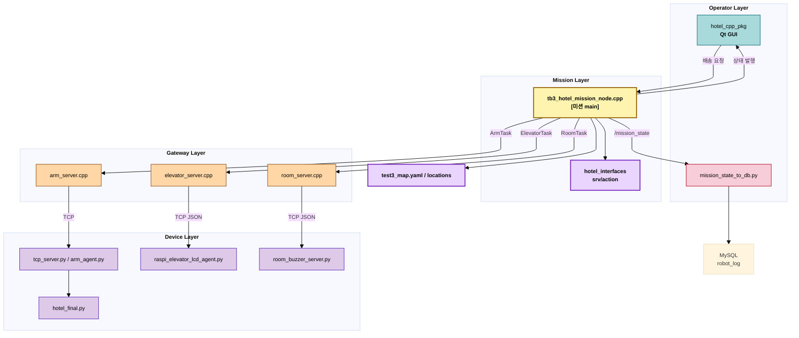

# <span style="color:#97BC62; background-color:#2C5F2D">호텔 짐 운반 로봇 시스템 (Hotel Transport Robot System)

> `TurtleBot3`, `OpenManipulator`, `ROS 2`, `Qt GUI`, `Raspberry Pi` 기반 외부 장치 서버를 연동하여 호텔 내 짐 배송 업무를 자동화하는 서비스 로봇 프로젝트입니다.

<br>

## <span style="color:#f400fe; background-color:#5e00bc">주요 기능 (Key Features)

* <span style="color:#3daeff; background-color:#00366b">**객실 배송 미션 자동 수행**</span>: 객실 요청이 들어오면 로봇이 적재 지점부터 객실 앞 배송, 복귀까지 전체 시나리오를 순차적으로 수행합니다.
* <span style="color:#3daeff; background-color:#00366b">**로봇팔 연동 적재 작업**</span>: `OpenManipulator` 기반 로봇팔이 객실별 적재 자세를 사용해 짐을 집고 TurtleBot 적재 위치에 올립니다.
* <span style="color:#3daeff; background-color:#00366b">**엘리베이터 연동 층간 이동**</span>: 라즈베리파이 에이전트와 TCP 통신하여 엘리베이터 호출, 문 열림/닫힘, 층 이동, 도착 안내를 처리합니다.
* <span style="color:#3daeff; background-color:#00366b">**객실 도착 알림**</span>: 객실 앞 도착 시 `GPIO` 기반 부저와 LED를 작동시켜 투숙객에게 배송 도착을 알립니다.
* <span style="color:#3daeff; background-color:#00366b">**실시간 상태 모니터링**</span>: `Qt GUI`와 `/mission_state` 토픽을 통해 배터리, 카메라, 미션 단계를 시각적으로 확인할 수 있습니다.
* <span style="color:#3daeff; background-color:#00366b">**미션 로그 DB 적재**</span>: 미션 상태 문자열을 파싱해 `MySQL`에 저장하여 운영 기록을 남깁니다.

<br>

## <span style="color:#f400fe; background-color:#5e00bc">시스템 아키텍처 (System Architecture)

이 프로젝트는 <span style="color:#dca400; background-color:#44270e">미션 오케스트레이션</span>, <span style="color:#dca400; background-color:#44270e">장치 게이트웨이</span>, <span style="color:#dca400; background-color:#44270e">현장 장치 에이전트</span>를 분리한 구조입니다. ROS 2 노드는 고수준 배송 시퀀스를 관리하고, 각 장치 서버는 TCP 기반으로 로봇팔/엘리베이터/객실 알림 장치와 연결됩니다.



<br>

## <span style="color:#f400fe; background-color:#5e00bc">파일 구조 (File Structure)

프로젝트는 ROS 2 워크스페이스와 외부 장치용 Python 스크립트를 분리하여 <span style="color:#dca400; background-color:#44270e">역할별 책임</span>이 명확하도록 구성되어 있습니다.

```text
.
|- README.md
|- hotel_final.py                         # OpenManipulator 기반 로봇팔 적재 시퀀스
|- tcp_server.py                          # 로봇팔 동작 요청용 TCP 서버
|- arm_agent.py                           # 로봇팔 스크립트 실행 에이전트 예시
|- raspi_elevator_lcd_agent.py            # 엘리베이터 LCD/음성 안내 라즈베리파이 서버
|- room_buzzer_server.py                  # 객실 부저/LED 알림 라즈베리파이 서버
|- mission_state_to_db.py                 # /mission_state -> MySQL 저장 노드
|- make_sounds.py                         # 엘리베이터 안내 음성 파일 생성 스크립트
|- test3_map.yaml                         # Nav2 지도 설정
|- test3_map.pgm                          # 맵 이미지
|- 호텔 프로젝트 실행 명령어.txt            # 실험 환경 실행 메모
|
`- mini02_turtlebot/
   `- src/hotel_system/
      |- hotel_interfaces/                # RequestDelivery, RequestGoTo, Arm/Elevator/Room 액션
      |- hotel_device_servers/            # ROS 2 액션 <-> TCP 게이트웨이 서버
      |- tb3_hotel_mission/               # TurtleBot 미션 오케스트레이터
      `- hotel_cpp_pkg/                   # Qt GUI, 카메라/배터리/상태 시각화
```

<br>

## <span style="color:#f400fe; background-color:#5e00bc">동작 흐름 (Mission Flow)

1. `Qt GUI` 또는 ROS 2 서비스로 `ROOM_201`, `ROOM_202`, `ROOM_203` 같은 배송 요청을 전송합니다.
2. `tb3_hotel_mission` 노드가 요청을 받아 현재 작업을 초기화하고 새 미션을 시작합니다.
3. TurtleBot3가 `ARM` 위치로 이동합니다.
4. `arm_server.cpp`가 TCP 요청을 보내고, `tcp_server.py` 또는 `arm_agent.py`가 `hotel_final.py`를 실행해 짐 적재를 수행합니다.
5. 로봇은 1층 엘리베이터 앞으로 이동하고 `elevator_server.cpp`가 라즈베리파이 에이전트에 호출 명령을 보냅니다.
6. 엘리베이터 탑승 후 2층으로 이동하고, 도착 응답을 받으면 로봇이 객실 방향으로 이동합니다.
7. 객실 앞 도착 시 `room_server.cpp`가 `room_buzzer_server.py`에 알림을 보내 부저와 LED를 작동시킵니다.
8. 배송 완료 후 로봇은 다시 엘리베이터를 이용해 1층으로 복귀하고 `WAIT_LOCATION`으로 돌아갑니다.
9. 전체 단계는 `/mission_state`로 발행되며 GUI 표시와 DB 로깅에 함께 사용됩니다.

<br>

## <span style="color:#f400fe; background-color:#5e00bc">설치 및 실행 방법 (Installation & Usage)

### 1. 환경 준비 (Environment Setup)

&emsp;&emsp;**1) ROS 2 환경 로드**
```bash
source /opt/ros/humble/setup.bash
export ROS_DOMAIN_ID=16
export TURTLEBOT3_MODEL=burger
```

&emsp;&emsp;**2) 워크스페이스 빌드**
```bash
cd mini02_turtlebot
colcon build
source install/setup.bash
```

&emsp;&emsp;**3) Python 의존성 설치**
```bash
pip install mysql-connector-python pygame RPLCD RPi.GPIO
```

> **Note**: `RPLCD`, `RPi.GPIO`는 일반적으로 라즈베리파이 환경에서 사용합니다. 메인 PC와 라즈베리파이의 설치 패키지는 분리해서 준비하는 것이 안전합니다.

### 2. TurtleBot3 및 내비게이션 실행 (Robot Bringup)

```bash
ros2 launch turtlebot3_bringup robot.launch.py
ros2 launch turtlebot3_navigation2 navigation2.launch.py use_sim_time:=true map:=$HOME/test3_map.yaml
```

### 3. 카메라 및 ROS 2 패키지 실행 (Core Services)

```bash
ros2 run camera_ros camera_node --ros-args -p format:="RGB888" -p width:=640 -p height:=480
ros2 run image_transport republish compressed raw --ros-args --remap in/compressed:=/camera/image_raw/compressed --remap out:=/image_raw
ros2 launch hotel_device_servers device_servers.launch.py
ros2 launch tb3_hotel_mission hotel_mission.launch.py
ros2 run hotel_cpp_pkg hotel_gui_node
```

### 4. 외부 장치 서버 실행 (Device Agents)

```bash
python3 tcp_server.py
python3 arm_agent.py
python3 raspi_elevator_lcd_agent.py
python3 room_buzzer_server.py
python3 mission_state_to_db.py
```

### 5. 로봇팔 Bringup (Manipulator Bringup)

```bash
ros2 launch open_manipulator_bringup omx_f.launch.py usb_port:=/dev/ttyACM0 baud_rate:=1000000
```

### 6. 수동 테스트 예시 (Manual Test)

```bash
ros2 service call /request_delivery hotel_interfaces/srv/RequestDelivery "{room_id: ROOM_201}"
ros2 service call /request_goto hotel_interfaces/srv/RequestGoTo "{target_id: ARM}"
ros2 topic echo /mission_state
```

<br>

## <span style="color:#f400fe; background-color:#5e00bc">주요 기술 스택 (Tech Stack)

- **언어**: `Python`, `C++`
- **로봇 미들웨어**: `ROS 2 Humble`, `Nav2`, `rclcpp`, `rclpy`
- **모바일 로봇**: `TurtleBot3`
- **매니퓰레이터**: `OpenManipulator`
- **GUI**: `Qt`
- **장치 통신**: `TCP Socket`, `JSON`
- **하드웨어 제어**: `Raspberry Pi GPIO`, `I2C LCD`, `pygame`
- **데이터 저장**: `MySQL`

<br>

## <span style="color:#f400fe; background-color:#5e00bc">운영 시 확인할 설정 (Configuration Notes)

- `hotel_device_servers/src/arm_server.cpp`: 로봇팔 서버 IP/포트 기본값 확인
- `hotel_device_servers/src/elevator_server.cpp`: 엘리베이터 라즈베리파이 IP/포트 확인
- `hotel_device_servers/src/room_server.cpp`: 객실 알림 라즈베리파이 IP/포트 확인
- `mission_state_to_db.py`: MySQL 접속 정보 확인
- `arm_agent.py`: `ARM_SCRIPT` 경로를 실제 로봇팔 제어 스크립트 위치로 수정
- `hotel_cpp_pkg/src/bot3_goal_qt/mainwidget.cpp`: Flask 연동 주소가 있다면 운영 환경 주소로 수정

<br>

## <span style="color:#f400fe; background-color:#5e00bc">향후 개선 계획 (Future Plans)

- <span style="color:#dca400; background-color:#44270e">**설정 외부화**</span>: IP, 포트, DB 계정, 경로 정보를 코드에서 분리해 `.yaml` 또는 환경 변수로 관리
- <span style="color:#dca400; background-color:#44270e">**좌표 관리 개선**</span>: 위치 좌표를 C++ 코드 하드코딩 대신 설정 파일 기반으로 전환
- <span style="color:#dca400; background-color:#44270e">**운영 안정성 강화**</span>: 장치 재시도, 타임아웃, 예외 처리, 상태 복구 로직 보강
- <span style="color:#dca400; background-color:#44270e">**서비스 확장**</span>: 더 많은 객실, 층, 배송 유형을 처리할 수 있도록 미션 시퀀스 일반화
